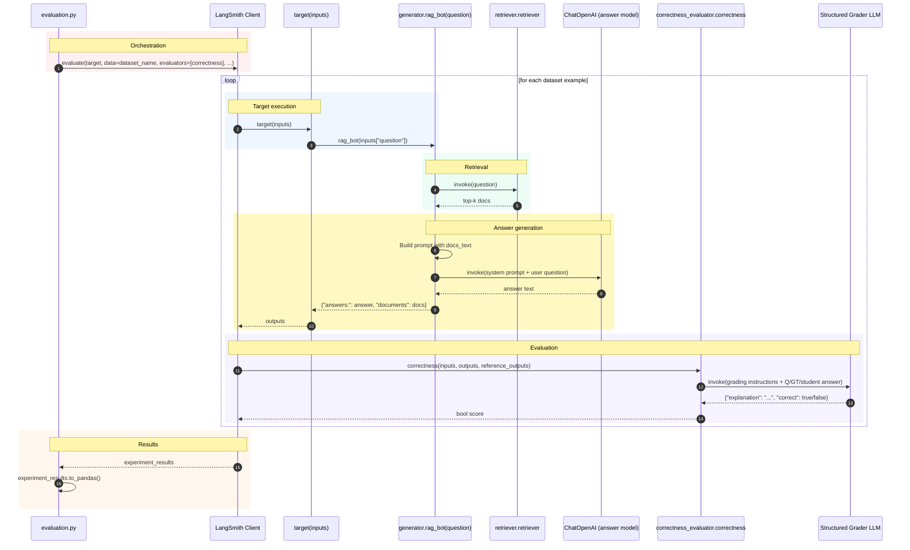

# RAG Evaluation Sequence Diagram

## How to export

1. Open this file in VS Code and press Ctrl+Shift+V for Markdown preview.
2. If your Mermaid extension supports it, right-click the rendered diagram and export to SVG/PNG.
3. If not, copy the Mermaid block into https://mermaid.live and export from there.
